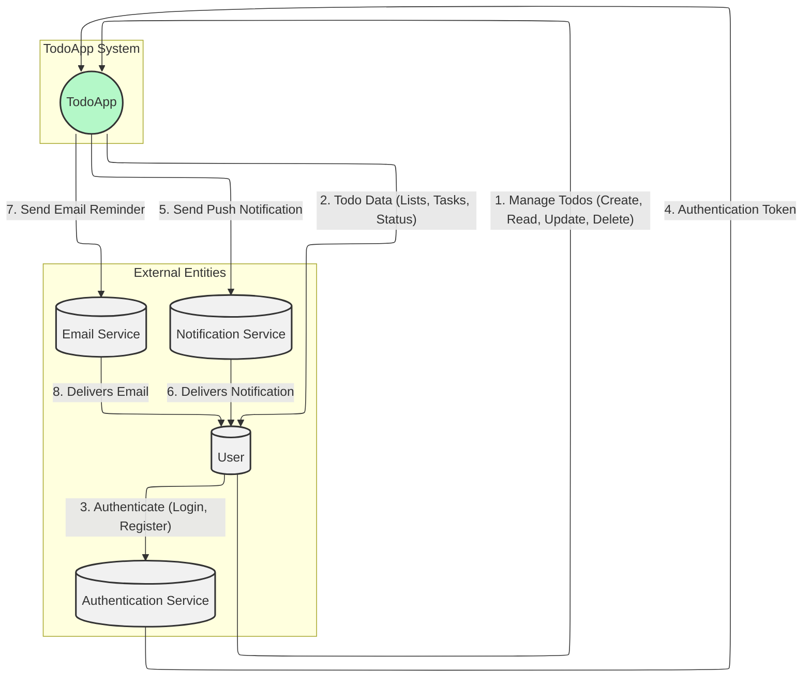
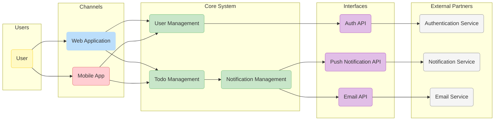
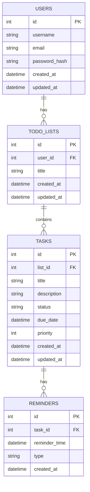
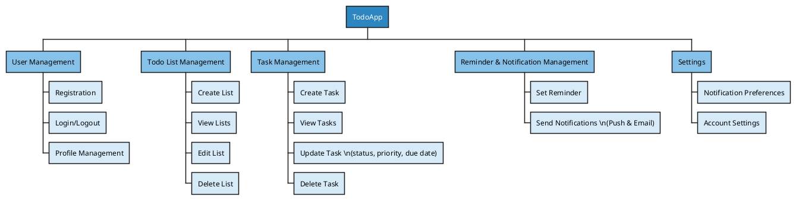
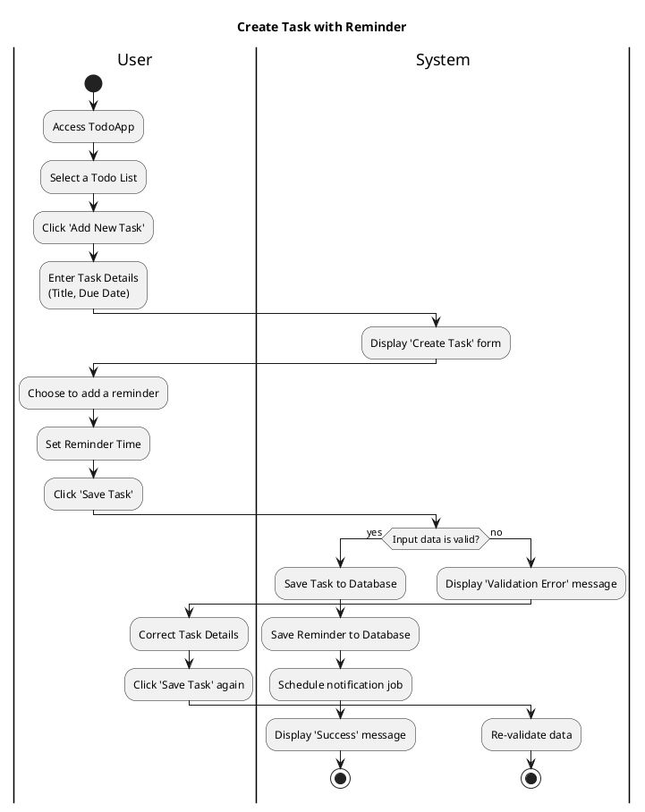
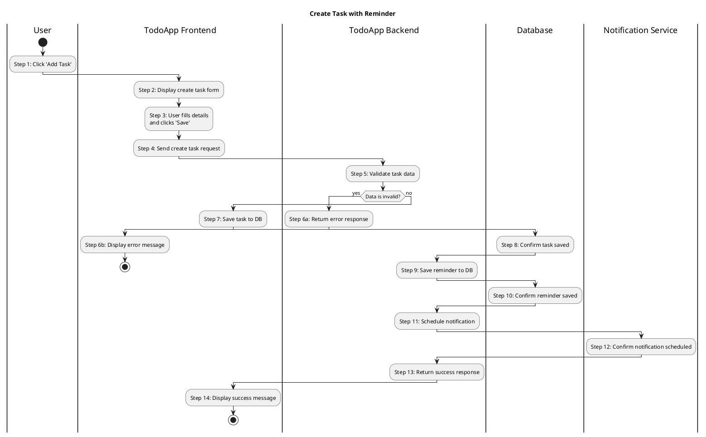
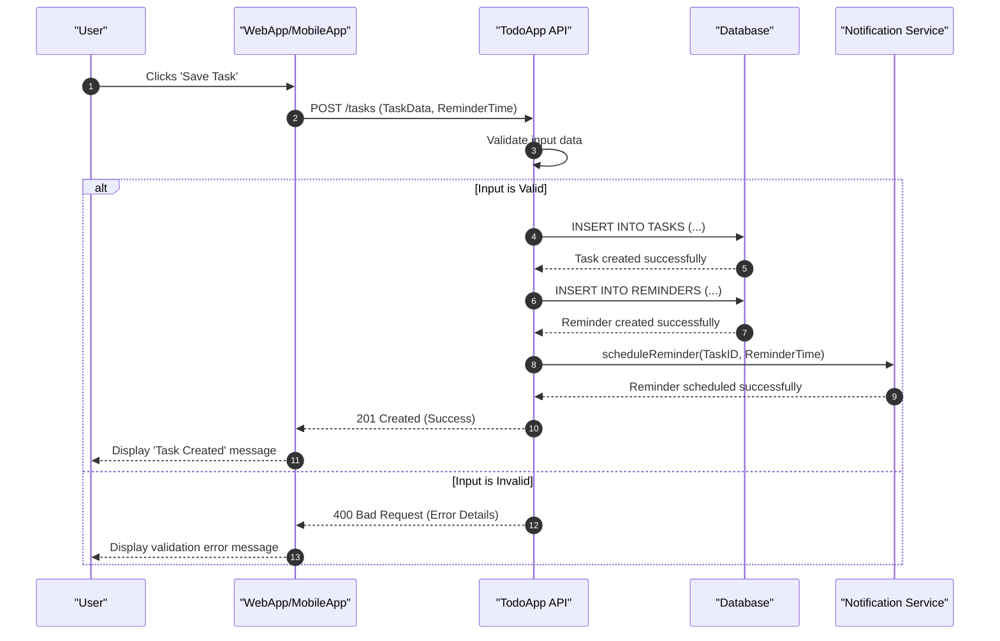
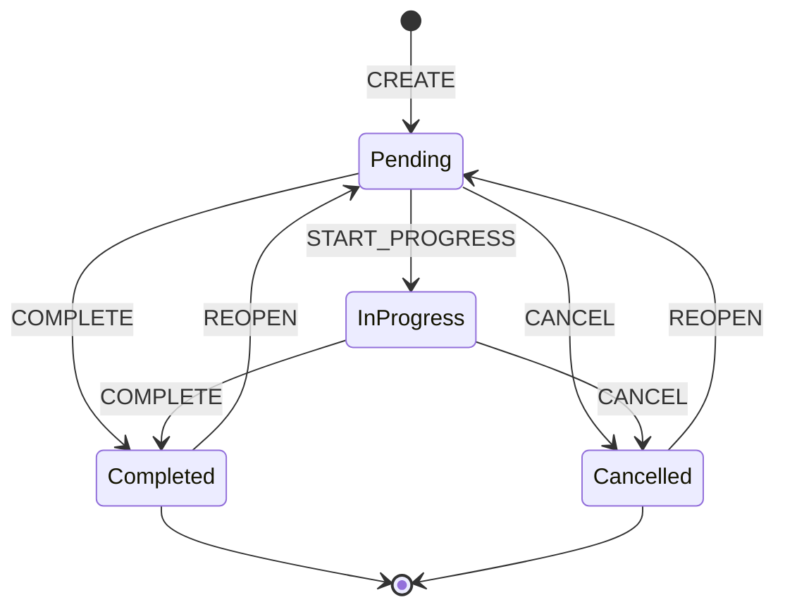
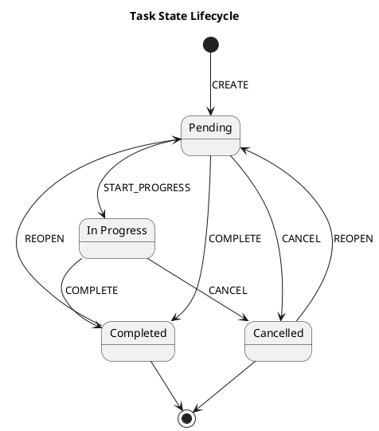

# Software Requirements Specification (SRS) for TodoApp

This document provides a detailed specification of the requirements for the TodoApp system.

---

## 1. System Context Diagram

This diagram illustrates the boundaries of the TodoApp system and its interactions with external entities.

### Data Flow Description

| No | Component | Incoming Flow | Outgoing Flow | Interface | Details |
| :-- | :--- | :--- | :--- | :--- | :--- |
| 1 | User → TodoApp | - | Manage Todos | GUI | User creates, views, updates, or deletes their todo lists and tasks through the web or mobile interface. |
| 2 | TodoApp → User | Todo Data | - | GUI | The system displays the user's todo lists, tasks, and their current status. |
| 3 | User → AuthService | - | Authenticate | API | User provides credentials (e.g., email/password, Google account) to log in or register. |
| 4 | AuthService → TodoApp | Authentication Token | - | API | The authentication service validates the user's credentials and sends a security token to the TodoApp system. |
| 5 | TodoApp → NotificationService | - | Send Push Notification | API | The system sends a request to the notification service to deliver a push notification to the user's device (e.g., task reminder). |
| 6 | NotificationService → User| Delivers Notification | - | Push | The notification service pushes the reminder to the user's registered device. |
| 7 | TodoApp → EmailService | - | Send Email Reminder | API | The system sends a request to the email service to deliver an email reminder to the user. |
| 8 | EmailService → User | Delivers Email | - | SMTP | The email service delivers the reminder to the user's inbox. |

---

## 2. Overview Model

This model provides a high-level view of the system's architecture, including user channels, core modules, and integrations with external partners.

### Component Description

| Actor/System | Channel/Interface | Description (Input/Output) |
| :--- | :--- | :--- |
| **User** | - | A registered user who manages their tasks. |
| | Web Application | **Input**: User actions (login, create task, set reminder).   **Output**: Displays todo lists, tasks, and notifications. |
| | Mobile App | **Input**: User actions (login, create task, set reminder).   **Output**: Displays todo lists, tasks, and notifications. |
| **Core System**| - | The central TodoApp application. |
| | User Management | Handles user registration, authentication, and profile management. |
| | Todo Management | Manages the creation, updating, deletion, and organization of tasks and todo lists. |
| | Notification Management| Schedules and triggers reminders via push notifications and emails. |
| **External Partners** | - | Third-party services integrated with the system. |
| | Authentication Service | **Input**: User credentials.   **Output**: Authentication tokens or error responses. |
| | Notification Service | **Input**: Notification payload (message, recipient).   **Output**: Delivery status. |
| | Email Service | **Input**: Email content (subject, body, recipient).   **Output**: Delivery status. |

---

## 3. Entity Relationship Diagram (ERD)

This diagram shows the database schema for the TodoApp.

### Entity Description

| Entity | Meaning | Fields |
| :--- | :--- | :--- |
| **USERS** | Stores user account information. | `id`, `username`, `email`, `password_hash`, `created_at`, `updated_at` |
| **TODO_LISTS** | Represents a user's list for grouping tasks. | `id`, `user_id`, `title`, `created_at`, `updated_at` |
| **TASKS** | Represents a single todo item. | `id`, `list_id`, `title`, `description`, `status` (e.g., 'pending', 'completed'), `due_date`, `priority` |
| **REMINDERS** | Stores reminder settings for a task. | `id`, `task_id`, `reminder_time`, `type` (e.g., 'push', 'email') |

---

## 4. Functional Decomposition Diagram (WBS)

This diagram breaks down the TodoApp system into its main functional components.

### Function Description

| No | Function Name | Channel | Users | Description |
| :-- | :--- | :--- | :--- | :--- |
| 1 | **User Management** | Web, Mobile | User | Manages user accounts, including registration, authentication, and profile updates. |
| 1.1 | Registration | Web, Mobile | User | Allows a new user to create an account. |
| 1.2 | Login/Logout | Web, Mobile | User | Allows a user to sign in and out of the application. |
| 1.3 | Profile Management | Web, Mobile | User | Allows a user to update their personal information (e.g., password, username). |
| 2 | **Todo List Management** | Web, Mobile | User | Manages collections of tasks. |
| 2.1 | Create List | Web, Mobile | User | Allows a user to create a new todo list. |
| 2.2 | View Lists | Web, Mobile | User | Displays all todo lists belonging to the user. |
| 2.3 | Edit List | Web, Mobile | User | Allows a user to rename a todo list. |
| 2.4 | Delete List | Web, Mobile | User | Allows a user to delete a todo list and all its associated tasks. |
| 3 | **Task Management** | Web, Mobile | User | Manages individual todo items. |
| 3.1 | Create Task | Web, Mobile | User | Allows a user to add a new task to a list. |
| 3.2 | View Tasks | Web, Mobile | User | Displays tasks within a selected list. |
| 3.3 | Update Task | Web, Mobile | User | Allows a user to modify task details like status, priority, and due date. |
| 3.4 | Delete Task | Web, Mobile | User | Allows a user to delete a task. |
| 4 | **Reminder & Notification Mgt.**| Web, Mobile | User | Manages alerts for tasks. |
| 4.1 | Set Reminder | Web, Mobile | User | Allows a user to set a date and time for a reminder. |
| 4.2 | Send Notifications | System | User | The system automatically sends push and/or email notifications at the scheduled time. |
| 5 | **Settings** | Web, Mobile | User | Manages user preferences. |
| 5.1 | Notification Preferences | Web, Mobile | User | Allows a user to enable/disable different types of notifications. |
| 5.2 | Account Settings | Web, Mobile | User | Allows a user to manage their account (e.g., delete account). |

---

## 5. Activity Diagram: Create Task with Reminder

This diagram illustrates the process of a user creating a new task and scheduling a reminder for it.

### Process Steps

| Step | Actor | Description | Notes |
| :--- | :--- | :--- | :--- |
| 1 | User | Opens the application and navigates to the desired todo list. | Assumes the user is already logged in. |
| 2 | User | Clicks the button to add a new task. | |
| 3 | System | Presents the user with a form to enter task details. | |
| 4 | User | Fills in the task title, description, due date, etc. | |
| 5 | User | Activates the 'Add Reminder' option and selects a specific time for the reminder. | /' AI suggested '/ This step is optional. |
| 6 | User | Submits the form to create the task. | |
| 7 | System| Validates the submitted data (e.g., title is not empty, due date is in the future). | |
| 8a | System| If validation passes, saves the new task and its associated reminder to the database. | This is the happy path. |
| 8b | System| Schedules a job to send a notification at the specified reminder time. | Interacts with a notification service. |
| 8c | System| Displays a confirmation message to the user. | e.g., "Task created successfully!" |
| 9a | System| If validation fails, displays an error message indicating what needs to be corrected. | e.g., "Title cannot be empty." |
| 9b | User | The user corrects the input and re-submits the form. | The process returns to Step 7. |

---

## 6. Business Process Swimlane: Create Task with Reminder

This diagram shows the detailed interactions between components when a user creates a task with a reminder.

### Process Steps

| Step | Actor | Action | Input | Output | Notes |
| :--- | :--- | :--- | :--- | :--- | :--- |
| 1 | User | Clicks the 'Add Task' button. | User click | - | Process starts. |
| 2 | TodoApp Frontend| Displays the form for creating a new task. | - | UI Form | |
| 3 | User | Fills in task details (title, due date) and reminder time, then clicks 'Save'. | Task data | - | ⭐ User can skip reminder. |
| 4 | TodoApp Frontend| Sends an API request to the backend with the task data. | Task data | API Request | |
| 5 | TodoApp Backend | Receives the request and validates the. | API Request | Validation Result | Checks for required fields, valid dates, etc. |
| 6a | TodoApp Backend | If validation fails, returns an error response. | Validation Result | API Error | e.g., `{ "error": "Title is required" }` |
| 6b | TodoApp Frontend| Displays the validation error message to the user. | API Error | UI Message | Flow ends until user corrects data. |
| 7 | TodoApp Backend | If validation succeeds, saves the new task record to the database. | Task Data | DB Query (INSERT) | |
| 8 | Database | Confirms that the task has been saved successfully. | - | DB Response | |
| 9 | TodoApp Backend | Saves the new reminder record to the database, linked to the task. | Reminder Data | DB Query (INSERT) | |
| 10 | Database | Confirms that the reminder has been saved successfully. | - | DB Response | |
| 11 | TodoApp Backend | Sends a request to the Notification Service to schedule the reminder. | Reminder details | API Request | |
| 12 | Notification Service| Confirms that the notification has been scheduled. | - | API Response | |
| 13 | TodoApp Backend | Returns a success response to the frontend. | - | API Success | e.g., `{ "status": "success" }` |
| 14 | TodoApp Frontend| Displays a success message to the user. | API Success | UI Message | e.g., "Task created!" |

---

## 7. Sequence Diagram: Create Task with Reminder

This diagram shows the sequence of interactions for creating a task with a reminder.

### Interaction Steps

| Step | Description | Entity/DB/External | Notes |
| :--- | :--- | :--- | :--- |
| 1 | The user fills out the task form and clicks the save button. | User Action | |
| 2 | The frontend application sends a POST request to the `/tasks` endpoint of the API, including the task and reminder data in the payload. | API Request | |
| 3 | The API server receives the request and performs validation on the data (e.g., checks for required fields, data formats). | Internal Processing | BA suggested: Validation is crucial for data integrity. |
| 4 | If the data is valid, the API sends an `INSERT` statement to the database to create a new record in the `TASKS` table. | Database | |
| 5 | The database confirms that the task record has been created. | Database | |
| 6 | The API sends another `INSERT` statement to the database to create a new record in the `REMINDERS` table, linked to the new task. | Database | This step is skipped if no reminder was set. |
| 7 | The database confirms that the reminder record has been created. | Database | |
| 8 | The API sends a request to the external Notification Service to schedule the push notification or email to be sent at the specified reminder time. | Notification Service | |
| 9 | The Notification Service confirms that the reminder has been successfully scheduled. | Notification Service | |
| 10 | The API returns a `201 Created` status code to the frontend, indicating that the task was created successfully. | API Response | |
| 11 | The frontend displays a success message to the user. | UI Update | |
| 12 | If the input data is invalid (alternative flow), the API returns a `400 Bad Request` status with error details. The frontend then displays this error to the user. | API/UI | |

---

## 8. Business Process Flow Description: Create Task

This table provides a detailed, field-level description of the "Create Task with Reminder" process.

| Step | Actor | Description | Notes |
| :--- | :--- | :--- | :--- |
| 1-2 | User / WebApp | **Action**: User clicks 'Save' and the app sends a POST `/tasks` request.   **Data Sent**: `{ "list_id": 123, "title": "string", "description": "string", "due_date": "YYYY-MM-DD", "priority": 1, "reminder_time": "YYYY-MM-DD HH:MM:SS" }` | |
| 3 | TodoApp API | **Action**: Validate incoming data.   **Rules**:   - `title`: required, string, max 255 chars.   - `list_id`: required, exists in `TODO_LISTS`.   - `due_date`: optional, must be a valid date, cannot be in the past.   - `reminder_time`: optional, must be a valid datetime, must be before `due_date`. | AI suggested |
| 4-5 | TodoApp API | **Action**: Save task to database.   **SQL**: `INSERT INTO TASKS (list_id, title, ...) VALUES (...)`   **State Change**: A new record is created in the `TASKS` table with `status = 'pending'`. | |
| 6-7 | TodoApp API | **Action**: If `reminder_time` exists, save reminder to database.   **SQL**: `INSERT INTO REMINDERS (task_id, reminder_time, type) VALUES (...)`   **State Change**: A new record is created in the `REMINDERS` table. | AI suggested |
| 8-9 | TodoApp API | **Action**: Schedule the notification job.   **Request to Notification Service**: `{ "recipient": "user_device_token", "message": "Reminder: ...", "send_at": "..." }` | The recipient token is retrieved based on the user's session. |
| 10-11 | TodoApp API / WebApp | **Action**: Return success and display message.   **API Response**: `HTTP 201 Created` with the new task object.   **UI**: A toast/popup "Task created successfully" is shown. | |
| 12 | (Alt Flow) API / WebApp | **Action**: If validation fails, return error.   **API Response**: `HTTP 400 Bad Request` with `{"error": "due_date cannot be in the past"}`.   **UI**: The form field is highlighted with the error message. | |

---

## 9. State Diagram: Task Lifecycle

This diagram illustrates the different states a task can be in throughout its lifecycle.

### State Transition Description

| From | Event | To |
| :--- | :--- | :--- |
| (Start) | CREATE | Pending |
| Pending | START_PROGRESS | InProgress |
| Pending | COMPLETE | Completed |
| InProgress | COMPLETE | Completed |
| Pending | CANCEL | Cancelled |
| InProgress | CANCEL | Cancelled |
| Completed | REOPEN | Pending |
| Cancelled | REOPEN | Pending |
| Completed | (End) | - |
| Cancelled | (End) | - |

---

## 10. State Diagram (PlantUML): Task Lifecycle

This diagram provides an alternative view of the task lifecycle using PlantUML.

### State Transition Details

| Entity | From | Event | Condition | Action | To |
| :--- | :--- | :--- | :--- | :--- | :--- |
| Task | (Initial) | CREATE | - | Set `status` to 'Pending' | Pending |
| Task | Pending | START_PROGRESS | - | Set `status` to 'In Progress' | InProgress |
| Task | Pending | COMPLETE | - | Set `status` to 'Completed' | Completed |
| Task | InProgress | COMPLETE | - | Set `status` to 'Completed' | Completed |
| Task | Pending | CANCEL | - | Set `status` to 'Cancelled' | Cancelled |
| Task | InProgress | CANCEL | - | Set `status` to 'Cancelled' | Cancelled |
| Task | Completed | REOPEN | User is owner | Set `status` to 'Pending' | Pending |
| Task | Cancelled | REOPEN | User is owner | Set `status` to 'Pending' | Pending |

---

## 11. UI Specification: Create Task Screen

This section specifies the UI components and validation rules for the "Create Task" screen.

| No | Purpose & Data | UI Component | Validation & Error Message |
| :-- | :--- | :--- | :--- |
| 1 | Screen Title | Label | **Content**: "New Task" or "Edit Task". |
| 2 | Task Title | Text Input | **Validation**: Required, Maxlength: 255.   **Error (ERR01)**: "Title is required."   **Error (ERR02)**: "Title cannot exceed 255 characters." |
| 3 | Task Description | Text Area | **Validation**: Optional, Maxlength: 1000.   **Error (ERR03)**: "Description cannot exceed 1000 characters." |
| 4 | Due Date | Date Picker | **Validation**: Optional. Must not be in the past.   **Error (ERR04)**: "Due date cannot be in the past." |
| 5 | Priority | Segmented Control | **Options**: Low, Medium, High.   **Default**: Medium. |
| 6 | Add Reminder | Switch / Toggle | **Default**: Off. Toggles visibility of the Reminder Time picker. |
| 7 | ⭐ Reminder Time | DateTime Picker | **Validation**: Required if "Add Reminder" is On. Must be before the Due Date.   **Error (ERR05)**: "Reminder time must be before the due date."   **Error (ERR06)**: "A reminder time is required."|
| 8 | Save Button | Button | **Action**: On click, validates the form. If valid, sends data to the API. If invalid, displays errors.   **State**: Disabled until the 'Title' field is filled. |
| 9 | ⭐ Cancel Button | Button / Icon | **Action**: Discards changes and navigates back to the previous screen. Shows a confirmation dialog if form has data. |

### Error Code Reference

| Error Code | Message |
| :--- | :--- |
| ERR01 | The <field> is required. |
| ERR02 | The <field> cannot exceed <maxlength> characters. |
| ERR03 | The <field> cannot exceed <maxlength> characters. |
| ERR04 | The due date cannot be in the past. |
| ERR05 | The reminder time must be earlier than the due date. |
| ERR06 | The reminder time is required when reminders are enabled. |

---

## 12. User Acceptance Test (UAT) Cases: Create Task

This section provides UAT cases for the "Create Task" functionality.

| Test Case ID | Scenario Description | Precondition | Test Steps | Expected Result |
| :--- | :--- | :--- | :--- | :--- |
| **Happy Path** |
| CT-001 | Create a full task with all details | User is logged in and is on the 'Todo List' screen. | 1. Tap 'Add Task'.   2. Enter a valid Title.   3. Enter a Description.   4. Select a future Due Date.   5. Select a Priority.   6. Enable 'Add Reminder' and select a valid time.   7. Tap 'Save'. | 1. A success message "Task created" appears.   2. The new task is visible in the todo list with all its details. |
| CT-002 | Create a simple task with only the required field | User is logged in and is on the 'Todo List' screen. | 1. Tap 'Add Task'.   2. Enter a valid Title.   3. Tap 'Save'. | 1. A success message "Task created" appears.   2. The new task is visible in the list with default values for other fields (e.g., no due date, medium priority). |
| **Negative Path** |
| CT-003 | Attempt to save a task with a blank title | User is on the 'Create Task' screen. | 1. Leave the Title field blank.   2. Tap 'Save'. | 1. An error message "Title is required" (ERR01) is displayed next to the title field.   2. The task is not saved. |
| CT-004 | Attempt to save a task with a past due date | User is on the 'Create Task' screen. | 1. Enter a valid Title.   2. Select a Due Date from the past.   3. Tap 'Save'. | 1. An error message "Due date cannot be in the past" (ERR04) is displayed.   2. The task is not saved. |
| CT-005 | Attempt to save a reminder time that is after the due date | User is on the 'Create Task' screen. | 1. Enter a valid Title.   2. Select a future Due Date (e.g., Tomorrow at 10:00 AM).   3. Enable 'Add Reminder'.   4. Select a Reminder Time that is after the due date (e.g., Tomorrow at 11:00 AM).   5. Tap 'Save'. | 1. An error message "Reminder time must be before the due date" (ERR05) is displayed.   2. The task is not saved. |
| **Boundary Path** |
| CT-006 | ⭐ Create a task with the maximum title length | User is on the 'Create Task' screen. | 1. Enter a Title with exactly 255 characters.   2. Tap 'Save'. | 1. The task is saved successfully.   2. The full title is displayed correctly (it may be truncated with "..." in the list view but fully visible in the detail view). |
| CT-007 | Create a task with a due date of today | User is on the 'Create Task' screen. | 1. Enter a valid Title.   2. Select today's date as the Due Date.   3. Tap 'Save'. | 1. The task is saved successfully.   2. The due date is displayed as "Today". |